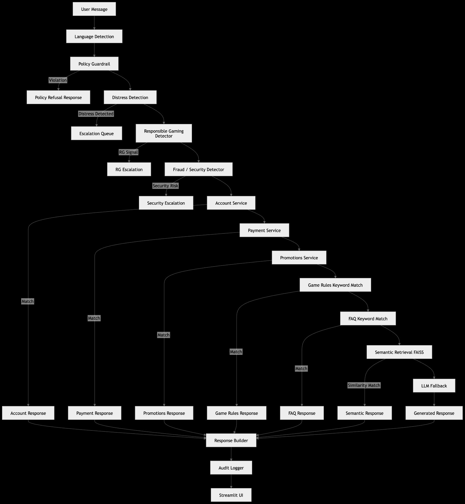

# AI Player Support Assistant


> **AI Player Support Assistant** is a safety-first routing system designed for iGaming customer support.  
> It prioritises deterministic safety detection and operational services before semantic retrieval and LLM fallback, minimising hallucination risk and LLM cost while maintaining full auditability.

**Key design properties:**
- **Safety-first routing** — distress, responsible gaming, fraud, and policy signals take priority over all other routes
- **Operational lookups** — account status, payments, and promotions resolved directly from live services
- **Semantic retrieval** — FAISS-based similarity search handles paraphrased and multilingual queries
- **LLM fallback** — Groq `llama-3.1-8b-instant` invoked only when all deterministic routes fail (Anthropic tested as alternative)
- **Governance layer** — audit logging, escalation queues, cost tracking, and operational metrics

```
User Message
     │
     ▼
Safety Layer  ──── distress / RG / fraud / circumvention / policy ──► Escalation
     │
     ▼
Operational   ──── account / payment / promotions ──► Response
     │
     ▼
Knowledge     ──── game rules / FAQ / cache        ──► Response
     │
     ▼
Semantic      ──── FAISS cosine retrieval          ──► Response
     │
     ▼
LLM Fallback  ──── Groq llama-3.1-8b (5% of queries) ──► Response
     │
     ▼
Audit Logger · Escalation Queue · Cost Monitor · Metrics
```

---

## 🚀 Live Demo

**Player UI** → [https://Zhildjian88.github.io/ai-player-support-assistant/](https://Zhildjian88.github.io/ai-player-support-assistant/)

The player UI is deployed as a static site on GitHub Pages and calls a FastAPI backend hosted on Render. No setup required — just open the link.

> For full deployment instructions see [DEPLOY.md](DEPLOY.md).

---

## Key System Metrics

| Metric | Result |
|--------|--------|
| **Deterministic Resolution Rate** | **90.8%** |
| Safety Detection Accuracy | 85% across distress, RG, fraud, and policy queries |
| Overall Routing Accuracy | 86.7% |
| LLM Fallback Rate | 5% |
| Test Coverage | 91 tests · 100% pass |

The system resolves roughly 91% of support queries without invoking an LLM by prioritising safety detectors, operational services, and semantic retrieval before fallback. This keeps latency low, prevents unnecessary model calls, and preserves a safety-first escalation path.

---

Built by SWK · March 2026  
Platform Integrity & Risk Lead | MSc AI/ML (Distinction)  
SiDO Strategies — AI Governance & Risk Advisory

---

## System Architecture

```
┌─────────────────────────────────────────────────────────────┐
│                        CLIENT LAYER                          │
│         GitHub Pages (docs/index.html) — Player UI          │
│         Streamlit (ui/streamlit_app.py) — Ops Console        │
└───────────────────────────┬─────────────────────────────────┘
                            │  POST /chat
┌───────────────────────────▼─────────────────────────────────┐
│                       CONTROL LAYER                          │
│              FastAPI  ·  Router  ·  Language Detector        │
│                  (hosted on Render)                         │
└───────────────────────────┬─────────────────────────────────┘
                            │  (priority order ↓)
┌───────────────────────────▼─────────────────────────────────┐
│                        SAFETY LAYER                          │
│    Policy Guardrail · Distress · Responsible Gaming · Fraud  │
└───────────────────────────┬─────────────────────────────────┘
                            │
┌───────────────────────────▼─────────────────────────────────┐
│                   DATA & KNOWLEDGE LAYER                     │
│   Account Service · Payment Service · Promotions Service     │
│   Game Rules Keyword Match · FAQ Keyword Match · Cache       │
└───────────────────────────┬─────────────────────────────────┘
                            │
┌───────────────────────────▼─────────────────────────────────┐
│                     INTELLIGENCE LAYER                       │
│          Semantic Retrieval (FAISS)  ·  LLM Fallback         │
└───────────────────────────┬─────────────────────────────────┘
                            │
┌───────────────────────────▼─────────────────────────────────┐
│                      GOVERNANCE LAYER                        │
│        Audit Logger · Escalation Queue · Cost Monitor        │
└─────────────────────────────────────────────────────────────┘
```

---

## Deployment

| Component | Hosting | URL |
|-----------|---------|-----|
| Player UI | GitHub Pages (static, free) | `https://Zhildjian88.github.io/ai-player-support-assistant/` |
| FastAPI backend | Render (free tier) | Your Render URL |
| Ops console | Local only | `streamlit run ui/streamlit_app.py` |

See **[DEPLOY.md](DEPLOY.md)** for the complete step-by-step deployment guide.

---

## Running Locally

```bash
# 1. Clone and install
pip install -r requirements.txt

# 2. Configure
cp .env.example .env
# Add your GROQ_API_KEY to .env

# 3. Initialise database
python -m app.db_init

# 4. Start FastAPI backend
uvicorn api.main:app --reload
# → http://localhost:8000

# 5. Ops console (separate terminal)
streamlit run ui/streamlit_app.py
# → http://localhost:8501

# 6. Player UI (browser)
# Open docs/index.html directly — or change API_BASE to localhost:8000
# and open via a local server

# 7. Run tests
pytest tests/ -v
```

> The player UI (`docs/index.html`) defaults to pointing at your Render URL.  
> For local testing, temporarily change `API_BASE` in `docs/index.html` to `http://localhost:8000`.

---

## Routing Pipeline



The Mermaid source is at `diagrams/router_pipeline.mermaid`.

The router follows a strict priority order. Safety and compliance checks execute first, followed by operational services, deterministic knowledge routes, cached responses, semantic retrieval, and finally LLM fallback. This ensures safety signals cannot be overridden by generative responses, and minimises unnecessary model calls.

---

## Routing Priority

| Step | Layer | Type | Exit condition |
|------|-------|------|----------------|
| 0 | Action token routing | Pre-processing | Deterministic bypass for UI quick actions |
| 1 | Language Detection | Pre-processing | Always runs |
| 2 | Policy Guardrail | Safety | Blocks prohibited queries |
| 3 | Distress Detection | Safety — CRITICAL | Escalates to human queue |
| 4 | Responsible Gaming | Safety — HIGH | Escalates to human queue |
| 5 | Fraud / Security | Safety — HIGH | Escalates to human queue |
| 6 | Circumvention Detector | Safety — HIGH | Welfare or fraud subtype escalation |
| 7 | Account Service | Operational | Real-time DB lookup |
| 8 | Payment Service | Operational | Real-time DB lookup |
| 9 | Promotions Service | Operational | Real-time DB lookup |
| 10 | Game Rules | Knowledge — keyword | Exact keyword match |
| 11 | FAQ | Knowledge — keyword | Exact keyword match |
| 12 | Cache | Exact match | Previously answered queries |
| 13 | Semantic Retrieval | Knowledge — vector | FAISS cosine similarity |
| 14 | LLM Fallback | Generative | Novel / ambiguous queries |

---

## Evaluation Results

Evaluated on 120 synthetic player support queries covering all route categories.

| Metric | Result |
|--------|--------|
| Total queries evaluated | 120 |
| Overall routing accuracy | 86.7% |
| Safety signal detection accuracy | 85.0% |
| Operational services accuracy | 97.7% |
| Knowledge route accuracy | 88.9% |
| Deterministic route resolution | 90.8% |
| Semantic retrieval resolution | 4.2% |
| LLM fallback rate | 5.0% |
| Average latency (warmed) | 15 ms |
| p95 latency | 30 ms |
| Test suite | 91 tests · 100% pass |

### Accuracy by Bucket

| Bucket | Correct | Total | Accuracy |
|--------|---------|-------|----------|
| Operational services (account, payment, promotions) | 42 | 43 | 97.7% |
| Knowledge routes (game rules, FAQ) | 24 | 27 | 88.9% |
| Safety signals (distress, RG, fraud, policy) | 34 | 40 | 85.0% |
| LLM fallback label¹ | 4 | 10 | 40.0% |

¹ The LLM fallback label accuracy of 40% reflects label-mismatch rather than system failure. Many queries labelled `llm_fallback` were correctly resolved by semantic retrieval or FAQ routes — a good answer through a different route than the label specified.

---

## System Components

```
ai-player-support-assistant/
├── api/
│   └── main.py                  # FastAPI — /chat /health /audit /escalations /cost/summary /metrics
├── app/
│   ├── router.py                # 14-step decision pipeline
│   ├── language_detector.py     # langdetect with graceful fallback
│   ├── policy_guardrail.py      # Blocks exploitation queries
│   ├── distress_detector.py     # Crisis signal detection — CRITICAL escalation (multilingual)
│   ├── rg_detector.py           # Responsible gaming signals — HIGH escalation
│   ├── fraud_detector.py        # Security / fraud signals — HIGH escalation
│   ├── circumvention_detector.py# Limit/exclusion bypass and multi-accounting
│   ├── account_service.py       # Account and KYC status from SQLite
│   ├── payment_service.py       # Payment and withdrawal status from SQLite
│   ├── promotions_service.py    # Active promotions from SQLite
│   ├── game_rules_service.py    # Game rules keyword match
│   ├── faq_service.py           # FAQ keyword match
│   ├── cache_service.py         # Exact-match answer cache
│   ├── similarity_service.py    # FAISS semantic retrieval — dual backend (neural / TF-IDF)
│   ├── llm_service.py           # Groq LLM fallback (default)
│   ├── llm_service_anthropic.py # Anthropic alternative
│   ├── cost_service.py          # Token usage and cost instrumentation
│   ├── context_service.py       # Bounded session context window (max 5 turns)
│   ├── response_builder.py      # Language-aware response composition
│   ├── audit_logger.py          # Full decision trace logging
│   ├── escalation_service.py    # Human review queue
│   └── db_init.py               # Schema and seed data
├── data/
│   ├── faq.json                 # 30 FAQ entries, 7 categories
│   ├── game_rules.json          # 6 games — RTP, house edge, rules
│   ├── promotions.json          # 8 promotions with SEA eligibility
│   ├── approved_answers.json    # 15 response templates × 6 languages
│   ├── users.json               # 10 synthetic users, all account states
│   ├── payments.json            # 15 synthetic transactions
│   ├── synthetic_queries.json   # 120 evaluation queries
│   └── app.db                   # SQLite runtime database
├── docs/
│   ├── index.html               # Player UI — static, deployed to GitHub Pages
│   ├── .nojekyll                # Disables Jekyll processing on GitHub Pages
│   └── README.md                # GitHub Pages deployment notes
├── ui/
│   ├── streamlit_app.py         # Ops console — 5-tab UI: Chat · Audit · Escalations · Cost · Metrics
│   ├── streamlit_player.py      # Legacy Streamlit player UI (superseded by docs/index.html)
│   └── router_bridge.py         # In-process bridge for Streamlit Cloud
├── diagrams/
│   ├── router_pipeline.png
│   └── router_pipeline.mermaid
├── tests/                       # 91 tests · 100% pass
├── Dockerfile                   # Full image — API + all deps (local / Docker Compose)
├── Dockerfile.render            # Lightweight API-only image for Render deployment
├── docker-compose.yml           # Local: FastAPI + Streamlit ops console
├── render.yaml                  # Render deployment config
├── requirements.txt             # Full local dependencies
├── requirements-api.txt         # Minimal API-only deps for Render deployment
├── DEPLOY.md                    # Step-by-step Render + GitHub Pages deployment guide
├── PORTFOLIO.md                 # Portfolio summary and talking points
└── .env.example                 # Environment variable template
```

---

## LLM Provider Options

| Provider | Model | Status | Notes |
|----------|-------|--------|-------|
| **Groq** | `llama-3.1-8b-instant` | **Default** | Free tier — set `GROQ_API_KEY` in `.env` or Render dashboard |
| Anthropic | `claude-haiku-4-5-20251001` | Optional | Replace `app/llm_service.py` with `app/llm_service_anthropic.py`, set `ANTHROPIC_API_KEY` |

---

## Semantic Retrieval

**Neural backend** (`USE_NEURAL_EMBEDDINGS=true`): FAISS IndexFlatIP on L2-normalised embeddings from `paraphrase-multilingual-MiniLM-L12-v2`. Maps 50+ languages into one vector space.

**Lexical backend** (`USE_NEURAL_EMBEDDINGS=false`, default): TF-IDF with (1,2)-gram tokenisation via the same FAISS interface. No model download required — suitable for Render free tier.

---

## Decision Trace

Every response carries a full decision trace:

```json
{
  "response":    "Your withdrawal of IDR 750,000 is currently pending...",
  "language":    "id",
  "route_taken": "payment_service",
  "intent":      "payment_status",
  "confidence":  1.0,
  "risk_level":  "LOW",
  "risk_flags":  [],
  "escalated":   false,
  "llm_called":  false,
  "audit_id":    "AUD-3F7A92C1B0",
  "session_id":  "a3f2e1d0-..."
}
```

---

## Multilingual Support

| Language | Code | UI Labels | Bot Responses |
|----------|------|-----------|---------------|
| English  | en   | ✓ | ✓ |
| Thai     | th   | ✓ | ✓ |
| Indonesian | id | ✓ | ✓ |
| Vietnamese | vi | ✓ | ✓ |
| Filipino | tl   | ✓ | ✓ |
| Chinese (Simplified) | zh | ✓ | ✓ |

---

## Known Limitations

- Uses synthetic data rather than real player interactions
- Retrieval corpus is small (57 anchors)
- Safety detectors use keyword matching rather than trained classifiers
- No authentication or rate limiting on the API
- No PII redaction before LLM calls
- SQLite is not suitable for concurrent multi-replica writes

---

## Design Trade-offs

| Decision | Chosen | Why | Trade-off | Production path |
|----------|--------|-----|-----------|-----------------|
| Database | SQLite | Zero external dependency, easy reproducibility | Not suitable for concurrent writes | Migrate to PostgreSQL |
| Routing order | Deterministic before LLM | Minimises hallucination risk, cost, latency | Keyword routes require maintenance | Expand semantic coverage; keep hard safety overrides |
| FAISS index | IndexFlatIP | Corpus under 1,000 docs — exact search is appropriate | Does not scale to very large corpora | Move to IVF/HNSW when corpus justifies it |
| Render image | `Dockerfile.render` (no ML deps) | Fits free tier, fast build | `USE_NEURAL_EMBEDDINGS` must be `false` on Render | Upgrade to paid tier if neural embeddings needed |

---

## 🎤 Talking Points

**"Walk me through your project."**  
I built a safety-first AI support routing system for an online gaming platform. The key design decision was prioritising deterministic safety and operational routes before any semantic or generative AI. The router checks policy violations, distress signals, responsible gaming signals, and fraud indicators first, then live operational services, then semantic retrieval, with the LLM used strictly as a final fallback. The player UI is deployed on GitHub Pages and calls a FastAPI backend on Render — fully live, no local setup needed for evaluators.

**"Why not use an LLM for everything?"**  
Generative models cannot guarantee deterministic behaviour, and they don't have access to operational data like account state or payment status. This system uses layered routing — deterministic safety checks, structured services, semantic retrieval, and only then an LLM fallback — giving you reliability where it matters and flexibility where determinism isn't required.

**"How did you control cost and latency?"**  
The router resolves over 90% of queries without invoking the model at all. For queries that do reach the LLM, a cost instrumentation layer records token usage, estimated USD cost, model name, success state, and latency per call — making LLM usage visible and auditable rather than a black box operational cost.

**"How would you extend this to production?"**  
Replace synthetic data with human-labelled production tickets; add confidence thresholds to route borderline cases to human review; build a feedback loop where reviewer decisions update the evaluation dataset; and add PII redaction before any content reaches the LLM. The architecture already supports all of these.

---

## 📝 License

© 2026 SiDO Strategies  
Published for portfolio and evaluation purposes.  
The code may be viewed and referenced for learning and evaluation.  
Commercial reuse or redistribution without written permission is prohibited.  
THE SOFTWARE IS PROVIDED "AS IS", WITHOUT WARRANTY OF ANY KIND.

Built by SWK · March 2026 · Platform Integrity & Risk Lead | MSc AI/ML (Distinction)  
SiDO Strategies — AI Governance & Risk Advisory
